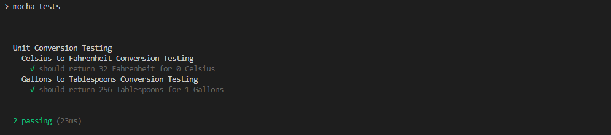
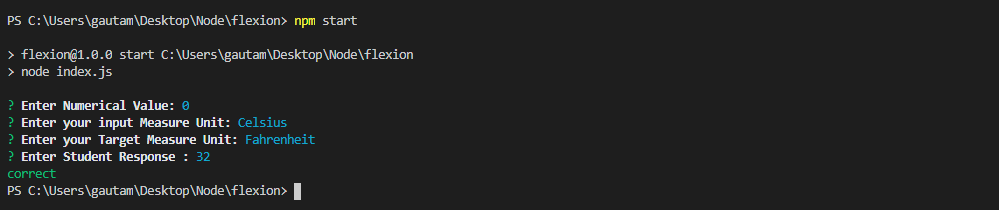

# Unit Converter

This Application is created for science teachers who are as comfortable using the command line as they are using a browser. In their “Unit Conversion” science unit, they want to assign students unit-conversion problems on paper worksheets. After students turn in their completed worksheet, the teachers want to be able to enter the questions and student responses into a computer to be graded. Students will convert:
temperatures between Kelvin, Celsius, Fahrenheit, and Rankine
volumes between liters, tablespoons, cubic-inches, cups, cubic-feet, and gallons

## Getting Started

Download or clone project from github to your Local system and install dependencies and start using the application.

### Prerequisites

You have to install nodejs and npm on your system.
To Install Node on Ubuntu:-
```
sudo apt update
sudo apt install nodejs
```

### Installing
Go to root directory of the project and run below command to install dependency

```
npm install
```

## Running the tests

```
npm test
```


## Run the Application

To Run Application go to the root directory and run the below command

```
npm start
```


## Built With

* [Inquirer](https://www.npmjs.com/package/inquirer) - A collection of common interactive command line user interfaces.
* [Chalk](https://www.npmjs.com/package/chalk) - Terminal string styling done right
* [Chai](https://www.npmjs.com/package/chai) - Chai is a BDD / TDD assertion library for node
* [Mocha](https://www.npmjs.com/package/mocha) - Simple, flexible, fun JavaScript test framework for Node.js & The Browser 


## Versioning

We use git for versioning. 

## Authors

* **Prashant Rathore** 

## License

This project is licensed under the MIT License - see the [LICENSE.md](LICENSE.md) file for details
